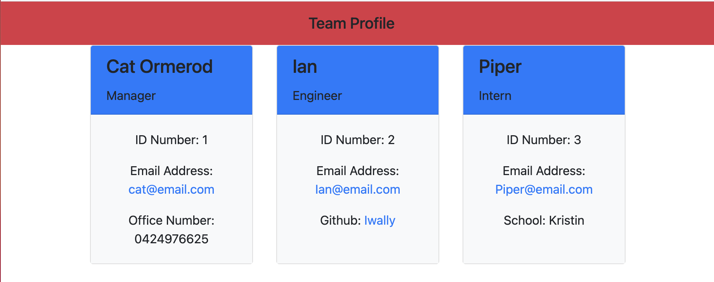

# team-profile-generator

## The Brief

A command-line application that takes in information about employees on a software engineering team, then generates an HTML webpage that displays summaries for each person.

## Basic features include:

```
    * Inquirer prompts to gather information about the team
        - use of validation on the email
        - use of when to determine which questions to show depending on what role is selected
        - function to ensure only 1 manager can be entered for the team
    * HTML generated from the employee data entered
    * Jest testing to run through the criteria proposed by instructors 
    

```

## Installation Instructions

Step 1 - Select the index.js file and right click to open in integrated terminal
Step 2 - Now please write 'npm i' in the terminal
Step 3 - In terminal enter "node index.js" to begin the inquirer programme prompts
Step 4 - Enter the required information for the team members
Step 5 - Once completed you will see a message "Successfully wrote index.html", open this file with a right click to see preview
Step 6 - To initiate the tests write 'npm test' in the terminal, all tests will then automatically run.  


## Screenshots





## URL

The repo can be viewed at the following URL <https://github.com/CatOrmerod/team-profile-generator/>
The index file can be viewed at the following URL <https://github.com/CatOrmerod/team-profile-generator/tree/main/dist/index.html>
The demo video can be viewed at the following URL <https://drive.google.com/file/d/1M_eMFVzGag3Fgw6AXvgsnCtP6irV7zLD/view?usp=sharing>
