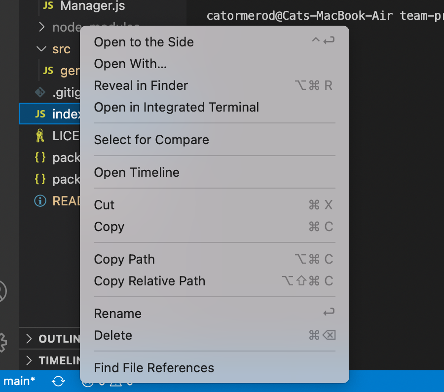
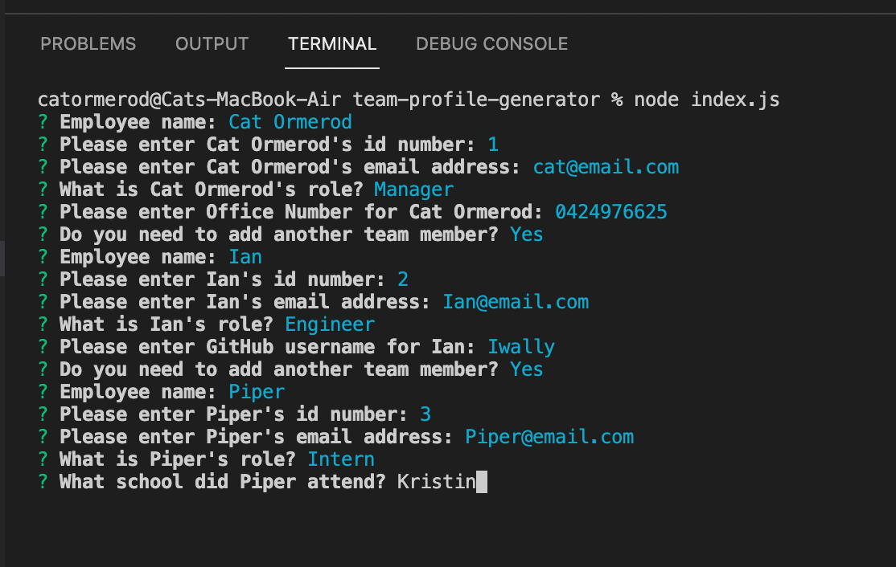
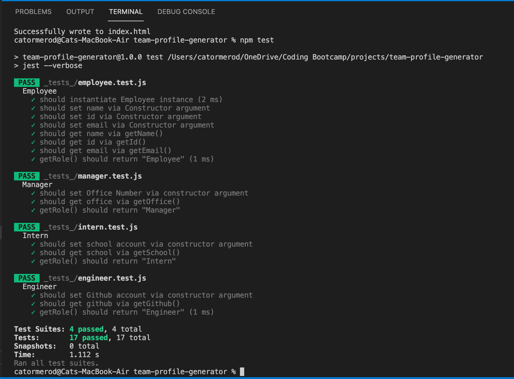

# team-profile-generator
A command-line application that takes in information about employees on a software engineering team, then generates an HTML webpage that displays summaries for each person.

## The Brief

Basic code was provided and we were required to build on that platform to create a command line application that generates a README file from the provided info.  

## Basic features include:

```
    * Utilisation of Inquirer for the command line prompts to gather information for the README.md
        - I used a default for the installation of 'npm i'
        - For the License section I used a list format
        - For the email section I added a validation function to ensure that something resembling an email was entered
    * For the license details I used an AXIOS api call to the GitHub website.  This is used when the value is not left blank
        - The API call brings back the Name, a URL, the Body of the license details and uses it to create a badge
        - I ran into a few issues when trying to ensure that the api was only called if the value was not blank, but eventually got there with a Promise resolve

```

## Installation Instructions

Step 1 - Select the index.js file and right click to open in integrated terminal
Step 2 - Now please write 'npm i' in the terminal
Step 3 - In terminal enter "node index.js" to begin the inquirer programme prompts
Step 4 - Enter the required information for the team members
Step 5 - Once completed you will see a message "Successfully wrote index.html", open this file with a right click to see preview
Step 6 - To initiate the tests write 'npm test' in the terminal, all tests will then automatically run.  


## Screenshots









## URL

The repo can be viewed at the following URL <https://github.com/CatOrmerod/team-profile-generator/>
The sample README can be viewed at the following URL <https://github.com/CatOrmerod/team-profile-generator/tree/main/dist/index.html>
The demo video can be viewed at the following URL <https://drive.google.com/file/>
